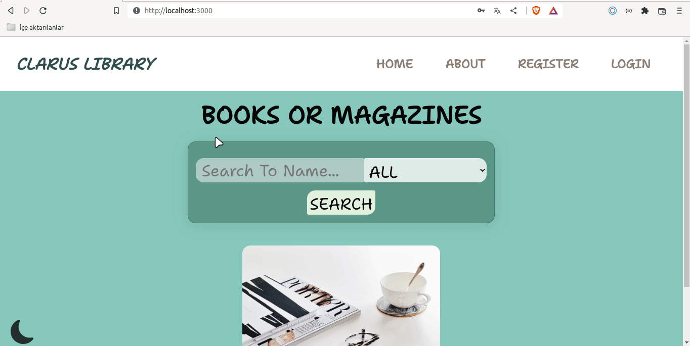

# Project : Clarusway Library

## Description

Project aims to create a Clarus Library.

## Project Skeleton

```
Clarusway Library (folder)
|
|----readme.md         # Given to the students (Definition of the project)
SOLUTION
├── public
│     └── index.html
├── src
│    ├── App.js
│    ├── assets
│    │   ├── about.png
│    │   ├── book.jpg
│    │   ├── books.jpg
│    │   └── const.png
│    │   │
│    ├── components
│    │   ├── card
│    │   │   ├── Card.jsx
│    │   │   └── Card.style.jsx
│    │   ├── footer
│    │   │   ├── Footer.jsx
│    │   │   └── Footer.style.jsx
│    │   ├── header
│    │   │   ├── Header.jsx
│    │   │   └── Header.style.jsx
│    │   └── navbar
│    │   │   ├── Navbar.jsx
│    │   │   └── Navbar.style.jsx
│    │   │
│    ├── context
│    │   ├── AuthContext.jsx
│    │   └── ThemeContext.jsx
│    │   │
│    ├── index.css
│    ├── index.js
│    │   │
│    ├── pages
│    │   ├── about
│    │   │   ├── About.jsx
│    │   │   └── About.style.jsx
│    │   ├── detail
│    │   │   ├── Detail.jsx
│    │   │   └── Detail.style.jsx
│    │   ├── home
│    │   │   ├── Home.jsx
│    │   │   └── Home.style.jsx
│    │   ├── login
│    │   │   ├── Login.jsx
│    │   │   └── Login.style.jsx
│    │   └── register
│    │   │   ├── Register.jsx
│    │   │   └── Register.style.jsx
│    │   │
│    ├── router
│    │   ├── AppRouter.jsx
│    │   └── PrivateRouter.jsx
│    │   │
│    └── styles
│        ├── Flex.jsx
│        ├── Global.styles.jsx
│        └── theme.js
├── package.json
└── yarn.lock
```

## Expected Outcome



### At the end of the project, following topics are to be covered;

- HTML

- CSS

- JS

- ReactJS

## Demo

<a href="" target="_blank">Clarusway Library</a>

## Google Books API

<a href="https://developers.google.com/books/docs/v1/using" target="_blank">Google Books API</a>
